# 🚭 담쪽이 - 세상에 나쁜 흡연자는 없다.

<br>

## 🔺 프로젝트 진행 기간
2024.01.08(월) ~ 2024.02.16(금)

<br>

## ✔️ Team Members
<table>
  <tr style="width : 100%">
    <td align="center"><br />최명성</td>
    <td align="center"><br />손종민</td>
    <td align="center"><br />김영후</td>
    <td align="center"><br />문지호</td>
    <td align="center"><br />박서현</td>
    <td align="center"><br />김다희</td>
  </tr>
</table>

<br>

## 👓 등장 배경
혹시 지금 담배를 피우고 계신가요 ?

금연을 목표로 여러 번 도전 했지만,, 매번 성공하지 못하셨나요 ?

혼자서는 금연의 길이 너무 험난하다고 느껴지시나요 ?

그렇다면, 그룹 기반 금연 지원 서비스 “담쪽이” 와 함께라면, 당신도 성공할 수 있습니다 !

<br>

## 🖍️ 개요
"담쪽이"는 금연을 향한 당신의 첫걸음을 응원합니다. 

여기서 '담쪽이'는 담배를 끊고자 하는 마음과 '금쪽같은 내 사람'의 의지를 합친 말로, 금연을 희망하는 모든 이들을 위한 특별한 칭호입니다. 

이 서비스는 금연을 지향하는 '담쪽이'와 그들을 지지하며 금연을 돕고자 하는 지인들이 '박사님'이 되어 함께 금연 챌린지에 참여함으로써, 금연 성공률을 높이는 것을 목표로 합니다.

<br>

## Usage
```
git clone https://lab.ssafy.com/s10-webmobile1-sub2/S10P12E105.git
```

<br>

## ✂️ 개발 환경
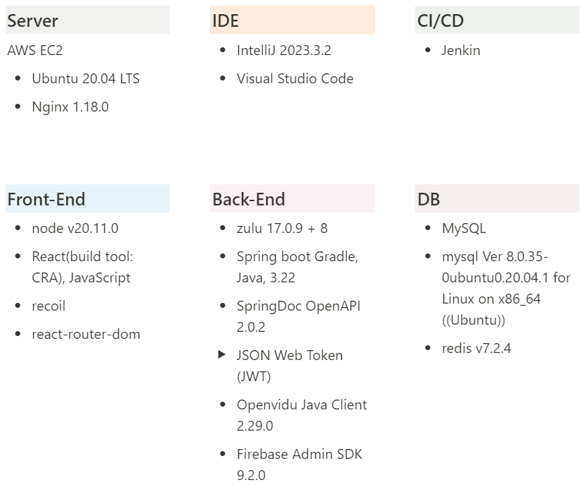

## 🛠️ Service Architecture
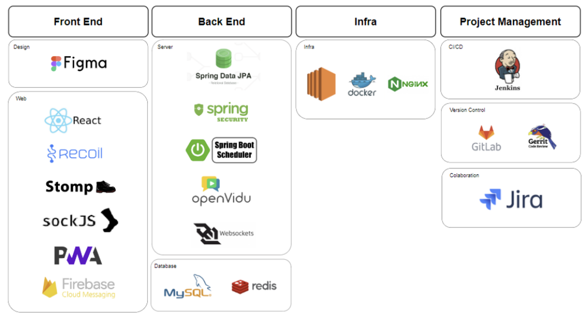

<br>

## 📂디렉토리 구조
<details>
  <summary>백엔드 디렉토리 구조</summary>

  ```plaintext
  BE
  ┣ common
  ┣ config
  ┣ controller
  ┃ ┣ websocket
  ┣ dto
  ┃ ┣ auth
  ┃ ┣ challenge
  ┃ ┣ cheermsg
  ┃ ┣ group
  ┃ ┣ notification
  ┃ ┣ proof
  ┃ ┣ request
  ┃ ┣ response
  ┃ ┣ schedule
  ┃ ┗ websocket
  ┣ entity
  ┣ exception
  ┣ filter
  ┣ handler
  ┣ provider
  ┣ repository
  ┣ service
  ┃ ┣ implement
  ┗ Server Application
```
</details>
<details>
  <summary>프론트엔드 디렉토리 구조</summary>

  ```plaintext
  FE
  ┣ public
  ┃ ┣ manifest.json
  ┃ ┣ firebase-messaging-sw.js
  ┃ ┗ index.html
  ┣ src
  ┃ ┣ apis
  ┃ ┣ assets
  ┃ ┃ ┣ gifs
  ┃ ┃ ┗ images
  ┃ ┣ components
  ┃ ┃ ┣ button
  ┃ ┃ ┣ TitleText
  ┃ ┣ contexts
  ┃ ┣ hooks
  ┃ ┣ pages
  ┃ ┃ ┣ challenge-page
  ┃ ┃ ┣ create-challenge-page
  ┃ ┃ ┣ empty-challenge-page
  ┃ ┃ ┣ group-list-page
  ┃ ┃ ┣ group-space-page
  ┃ ┃ ┣ home-tab-page
  ┃ ┃ ┣ invitation-code-page
  ┃ ┃ ┣ landing-page
  ┃ ┃ ┣ last-challenge-page
  ┃ ┃ ┣ oauth-page
  ┃ ┃ ┣ proof-tap-page
  ┃ ┃ ┣ reward-tab-page
  ┃ ┃ ┣ truth-room
  ┃ ┃ ┣ truth-room-tab-page
  ┃ ┣ util
  ┃ ┣ App.js
  ┃ ┣ index.js
  ┃ ┗ main.js
```
</details>

<br>

## 주요 기능 및 화면

#### 랜딩페이지 (네이버OAuth)

- 페이지 아래로 간단하게 서비스 소개가 되어 있습니다.
- 시작하기 버튼을 누르면, 네이버 로그인을 통해 간편하게 로그인할 수 있습니다.


#### 그룹 만들기

- 로그인하면 그룹을 선택할 수 있습니다.

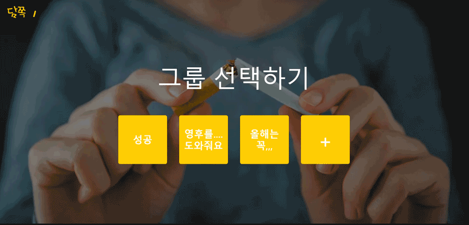


#### 챌린지 만들기

- 그룹 안에서 챌린지를 생성할 수 있습니다.
- 챌린지를 생성하는 본인은 바로 담쪽이가 되어 챌린지를 시작하게 됩니다.

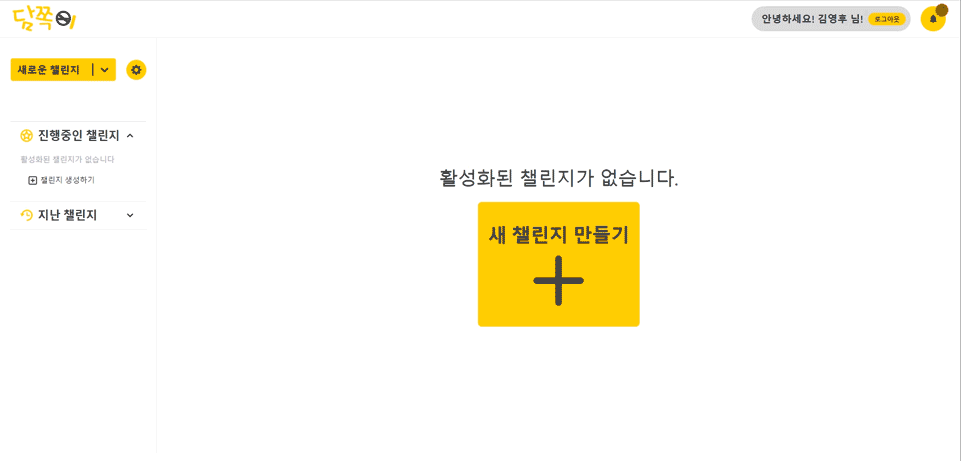


#### 박사님이 담쪽이를 응원하는 방법 & 알림

- 박사님은 이 페이지에서 응원하기 버튼으로 사탕을 전달할 수 있습니다.
- 버튼을 누르면 사탕이 떨어지면서 응원 수가 올라갑니다.

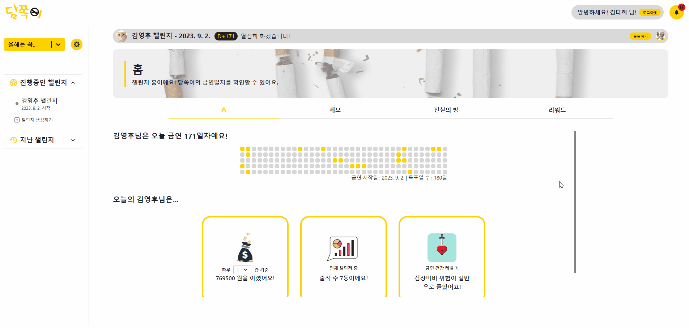

- 리워드 탭에서 성공 시 보여줄 응원 메시지를 작성할 수 있습니다.  

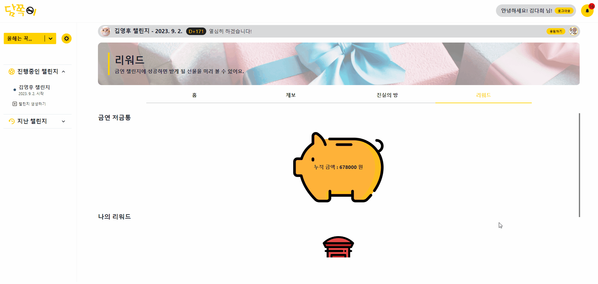


#### 담쪽이의 동기부여

- 담쪽이 본인이 만든 챌린지에서는, 응원하기 대신 출석하기 버튼이 있습니다.
- 출석 버튼을 누르면, 스트릭에 해당하는 날짜의 칸이 채워집니다.

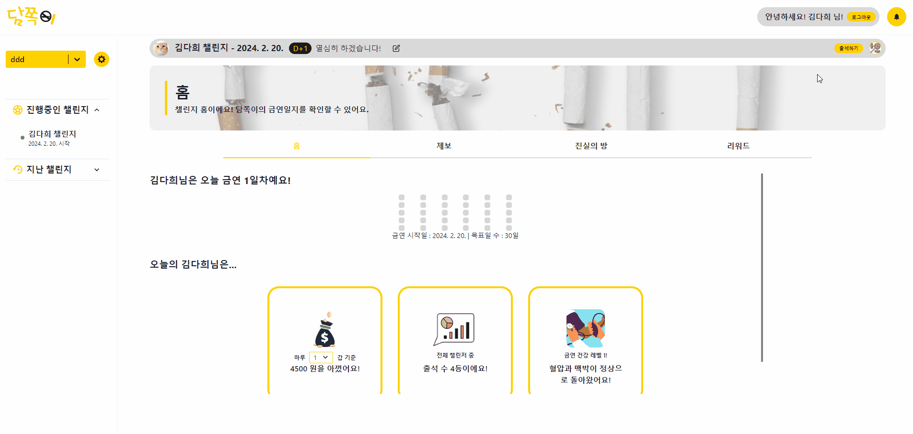

- 담쪽이가 챌린지에 성공하게 되면 성공 모달이 나오게 됩니다.
- 성공 모달에서는 챌린지 기간동안 박사님의 응원 메시지, 사탕 갯수, 적립 금액 등을 확인할 수 있습니다.

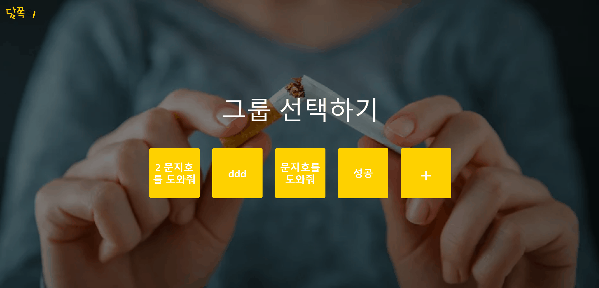


#### 증언 & 증거 생성

- 아래 페이지에서 증언과 증거를 작성할 수 있습니다.
- 찍어둔 사진을 증거로 제출하면, 담쪽이에게 알림이 가고 진실의 방 일정을 잡게 됩니다.

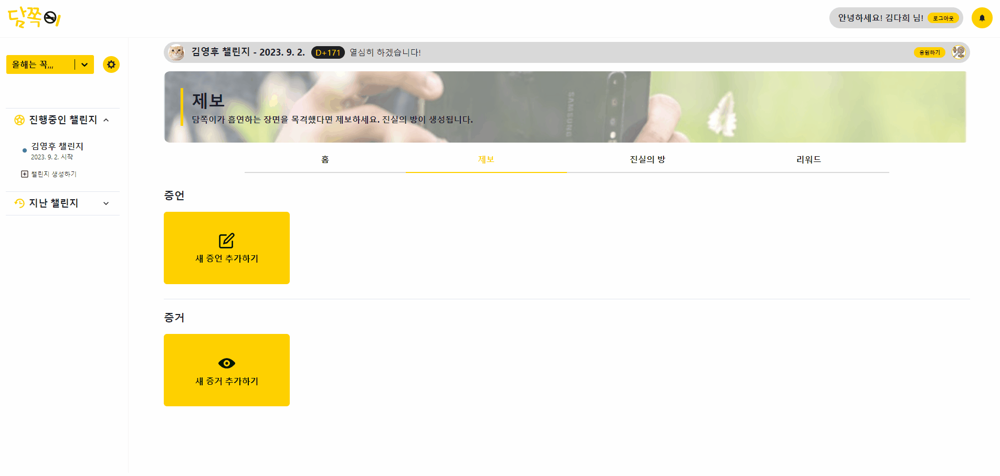


#### 진실의 방 일정 잡기

- 제보가 들어왔으니 진실의 방 일정을 잡아봅시다.
- 진실의 방 일정은 제보가 들어왔을시에, 담쪽이가 생성 가능합니다.

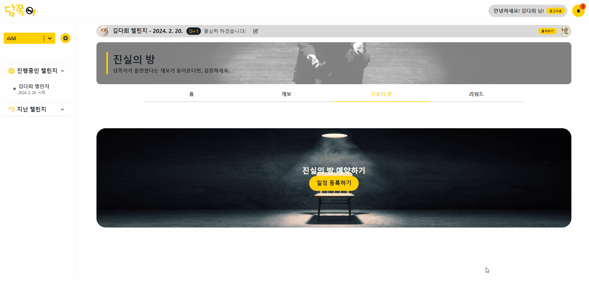


#### 진실의 방 일정 과정

- 진실의 방에 들어오는 순간 아래와 같은 순서로 흘러가게 됩니다.
- 대기중 -> 제보 판별 -> 투표 -> PASS/FAIL -> 최후 변론 -> 벌금 결정 -> 종료

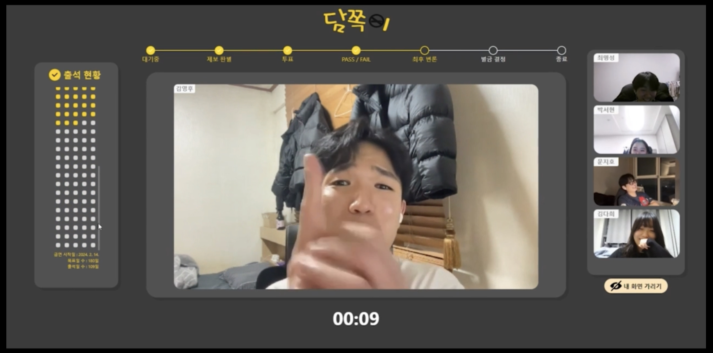

