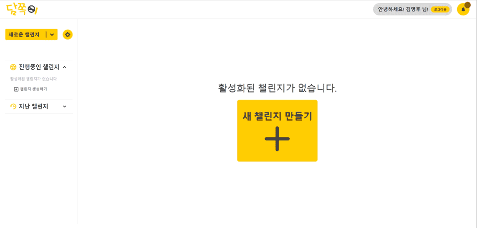
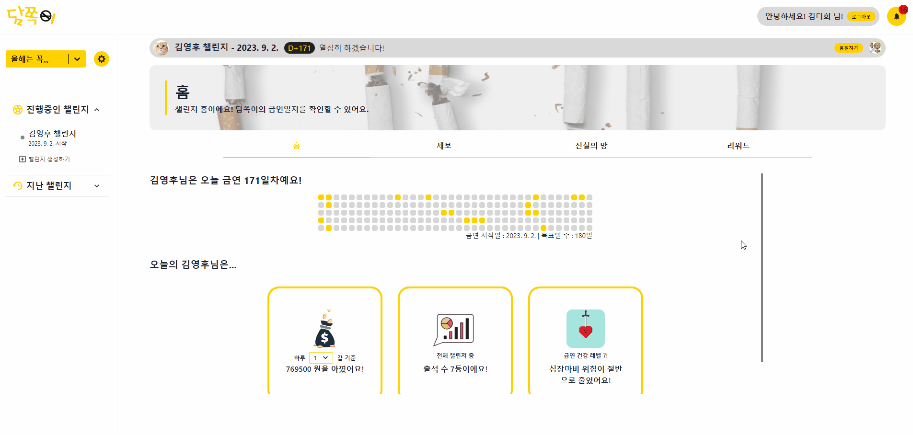
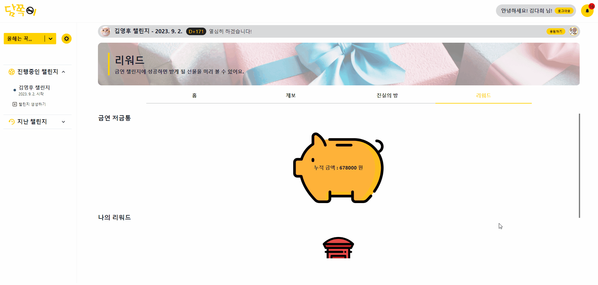
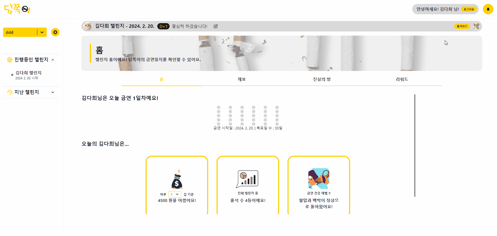
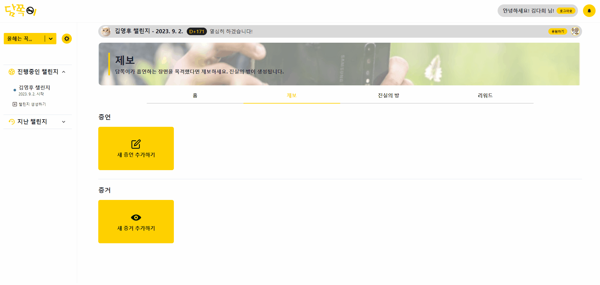
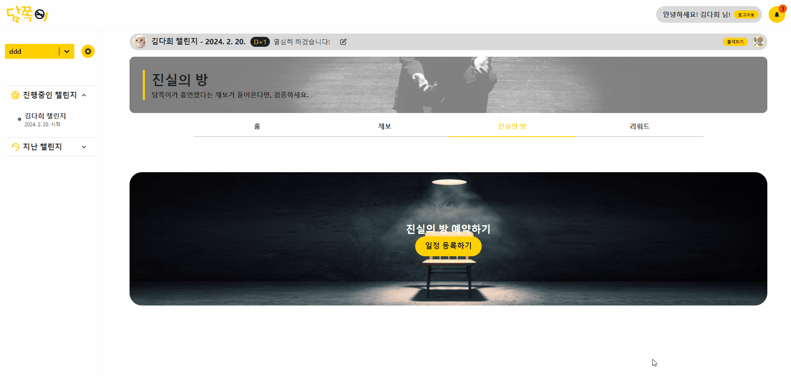

# ⚡포팅 메뉴얼


## 목차

1. 환경설정 및 빌드 & 배포
2. 외부 서비스 문서
3. 시연시나리오


## 1. 환경설정 및 빌드&배포


### 개발환경


### Docker 설치

### Set up the repository

1. Update the `apt` package index and install packages to allow `apt` to use a repository over HTTPS:

```
$ sudo apt-get update
$ sudo apt-get install \\
    ca-certificates \\
    curl \\
    gnupg \\
    lsb-release
```

1. Add Docker's official GPG key

```
$ sudo install -m 0755 -d /etc/apt/keyrings
$ sudo curl -fsSL https://download.docker.com/linux/ubuntu/gpg -o /etc/apt/keyrings/docker.asc 
```

1. Use the following command to set up the repository

```
$ echo \\
  "deb [arch=$(dpkg --print-architecture) signed-by=/etc/apt/keyrings/docker.gpg] <https://download.docker.com/linux/ubuntu> \\
$(lsb_release -cs) stable" | sudo tee /etc/apt/sources.list.d/docker.list > /dev/null
```

### Install Docker Engine

1. Update the apt package index

```
$ sudo apt-get update
```

1. Install Docker Engine, containerd, and Docker Compose

```
$ sudo apt-get install docker-ce docker-ce-cli containerd.io docker-buildx-plugin docker-compose-plugin
```


### MySQL 설치

### Install MySQL

```
$ sudo apt install mysql-server
$ sudo mysql -u root -p
$ CREATE USER '아이디'@‘%' identified with mysql_native_password by '비밀번호';
$ FLUSH PRIVILEGES;
$ create database test;
$ use test;
GRANT ALL PRIVILEGES ON etjude.* to ‘아이디'@‘%';
```


### 외부 접속 허용

```
$ sudo vi /etc/mysql/mysql.conf.d/mysqld.cnf
bind-address값을 0.0.0.0 으로 수정
$ sudo servie mysql restart
```


### Nginx 설치

```jsx
$ sudo apt-get install nginx
```


### **Encrypt(SSL 발급)**

```jsx
$ sudo apt-get install letsencrypt
$ sudo letsencrypt certonly --standalone -d [도메인]
```


### OPEN VIDU 설정 --> 명성

```jsx


```


### Nginx 설정 --> 명성

```jsx

```

### 환경변수 형태

```jsx
---------Spring------------
application.yml 내 환경변수 설정

spring:
  profiles:
    active: ${profile}
  jpa:
    hibernate:
      ddl-auto: none
    show-sql: true
    format_sql: true
    use_sql_comments: true
  jackson:
    date-format: yyyy-MM-dd'T'HH:mm:ss
    time-zone: UTC

springdoc:
  packages-to-scan: com.ssafy.server.controller
  default-consumes-media-type: application/json;charset=UTF-8
  default-produces-media-type: application/json;charset=UTF-8
  api-docs:
    path: /api-docs
  swagger-ui:
    path: /api/
    disable-swagger-default-url: true
    display-request-duration: true
    operations-sorter: alpha

logging:
  level:
    root: info
    org:
      hibernate:
        type:
          descriptor:
            sql: trace
```


### Ignore 파일 및 생성파일 위치

- Spring : applicaion.yml (main/resources/applicaion.yml)


## 빌드 및 배포 --> 명성 ( 아래 3가지 )


### 프론트엔드 빌드

```jsx

```

### 백엔드 빌드

```jsx
# 스프링 빌드
Mac => 
Windows => 


```

### 배포

```jsx
프론트엔드, 백엔드의 이미지를 풀 받은 후 컨테이너 실행
docker pull DockerHubID/DockerHubRepo:해당tag

# 백엔드(스프링)
docekr run --rm -d -p 8080:8080 --name be-latest 이미지ID
# 백엔드(파이썬)
docekr run --rm -d -p 5000:8080 --name flask-latest 이미지ID
# 프론트엔드
docekr run --rm -d -p 3000:80 --name fe-latest 이미지ID

컨테이너 확인 : docker ps
```


## 2. 외부 서비스 문서

### FireBase

1. FireBase 프로젝트 생성

   - firebase 로그인 후 Firebase 콘솔에서 “프로젝트 추가” 버튼 클릭
   - 프로젝트 이름 입력 → 계속 → (애널리틱스 화면) 계속 → 계정 선택 후 프로젝트 만들기

2. SDK 설정

   - 해당 프로젝트 콘솔로 접속
   - 웹 아이콘 (</>) 클릭
     - 앱 닉네임 등록, firebase sdk 추가 (npm 사용 체크)
     - 콘솔로 이동

3. Firebase Cloud Messaging API(V1) 설정

   - 웹 푸시 인증서 발급
   - 애플리케이션 ID 키 쌍을 사용하여 외부 푸시 서비스에 연결

4. Firebase package 설치

   ```jsx
   npm install firebase
   ```

### 소셜 로그인

1. 네이버 개발자 센터에서 내 어플리케이션 등록
2. API 설정, Callback URL, 서비스 URL 지정
- 네이버 로그인 : https://developers.naver.com/docs/login/overview/overview.md

  

## 3. 시연 시나리오


#### 랜딩페이지 (네이버OAuth)

- 페이지 아래로 간단하게 서비스 소개가 되어 있습니다.
- 시작하기 버튼을 누르면, 네이버 로그인을 통해 간편하게 로그인할 수 있습니다.


#### 그룹 만들기

- 로그인하면 그룹을 선택할 수 있습니다.


#### 챌린지 만들기

- 그룹 안에서 챌린지를 생성할 수 있습니다.
- 챌린지를 생성하는 본인은 바로 담쪽이가 되어 챌린지를 시작하게 됩니다.




#### 박사님이 담쪽이를 응원하는 방법 & 알림

- 박사님은 이 페이지에서 응원하기 버튼으로 사탕을 전달할 수 있습니다.
- 버튼을 누르면 사탕이 떨어지면서 응원 수가 올라갑니다.



- 리워드 탭에서 성공 시 보여줄 응원 메시지를 작성할 수 있습니다.  




#### 담쪽이의 동기부여

- 담쪽이 본인이 만든 챌린지에서는, 응원하기 대신 출석하기 버튼이 있습니다.
- 출석 버튼을 누르면, 스트릭에 해당하는 날짜의 칸이 채워집니다.



- 담쪽이가 챌린지에 성공하게 되면 성공 모달이 나오게 됩니다.
- 성공 모달에서는 챌린지 기간동안 박사님의 응원 메시지, 사탕 갯수, 적립 금액 등을 확인할 수 있습니다.


#### 증언 & 증거 생성

- 아래 페이지에서 증언과 증거를 작성할 수 있습니다.
- 찍어둔 사진을 증거로 제출하면, 담쪽이에게 알림이 가고 진실의 방 일정을 잡게 됩니다.




#### 진실의 방 일정 잡기

- 제보가 들어왔으니 진실의 방 일정을 잡아봅시다.
- 진실의 방 일정은 제보가 들어왔을시에, 담쪽이가 생성 가능합니다.




#### 진실의 방 일정 과정

- 진실의 방에 들어오는 순간 아래와 같은 순서로 흘러가게 됩니다.
- 대기중 -> 제보 판별 -> 투표 -> PASS/FAIL -> 최후 변론 -> 벌금 결정 -> 종료


